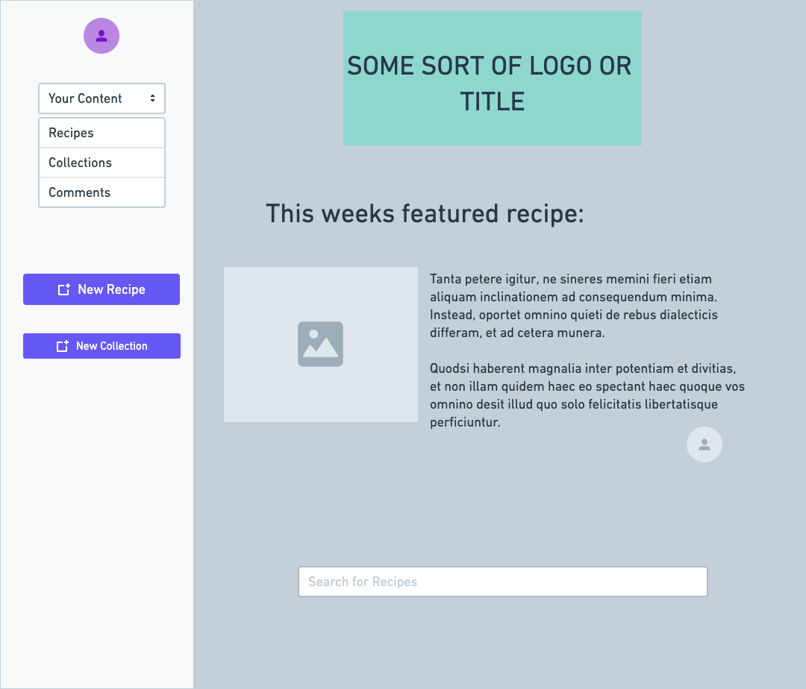
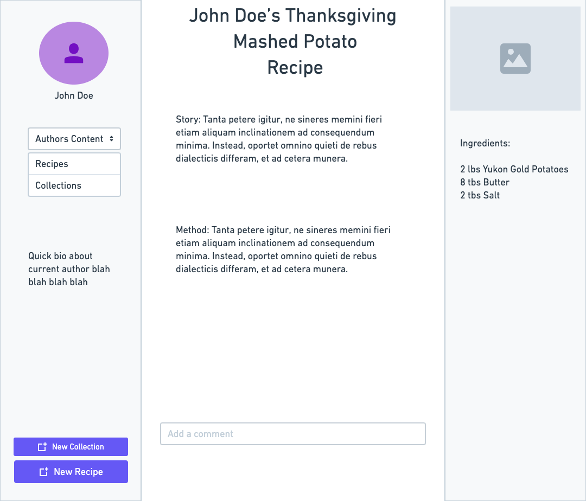
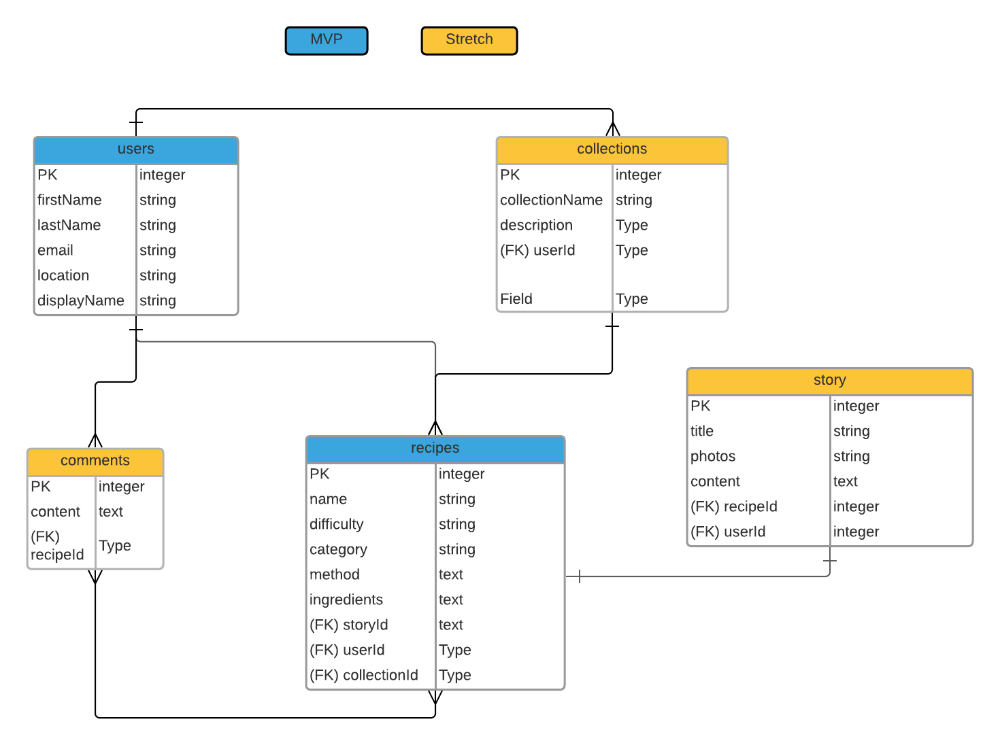

# Unnamed digital "cookbook" app

My favorite cookbooks have always been the ones that marry really great recipes, with even better stories. What I'm hoping to do with this app is give users the opportunity to be the author of their own cookbooks and share that with friends and family. 

## Tech Stack

* HTML5, CSS, JavaScript, Bulma to aid in styling

 * Node.js PostgreSQL, Sequelize, Express, EJS

 ## API

 --- 

I will be using the 'RESY API' to allow users to make a reservation to a specific restaurant when viewing their featured recipes. 

     GET /fact/random

     curl -X GET "http://api.fungenerators.com/fact/random?category=Food" -H  "accept: application/json" -H  "X-Fungenerators-Api-Secret: api_key"

Output:

     {
       "success": {
         "total": 1
       },
       "contents": {
         "fact": "The most iconic donut shop in   Hollywood is Randy's Donuts. It has appeared   in many movies including Crocodile Dundee      and Iron Man 2.",
         "id": "VbUC4jKvaxzHNgs2FRUthweF",
         "category": "Food ",
         "subcategory": "Donuts "
       }
     }

     

## User Stories
---

* I want to be able to not only store my recipes, but share why a recipe is important to me, or share a fun anecdote related to it

* I want to be able to save my recipes in collections so that I can stay organized and easily share them with friends and family. 

* I want to find fun recipes and be able to leave comments so the creator can know how much I enjoy them 

## Wireframe

## ERD
---

---

## MVP GOALS

1. Users can upload recipes that include a quick story on what makes this recipe special to them

2. Users create collections of their recipes (i.e. Grandmas Thanksgiving recipes) for easier sharing and organizing 

3. Recipes that belong to a restaurant will display google places info using the google maps api. 

## STRETCH GOALS

1. User will be able to find  

1. Intergrate (or make) an ingredient parser so ingredients can be entered as strings and broken down into units and ingredients 

2. Intergrate social media like features such as following an author, creating groups, and messaging 

3. Users can comment on individual recipes 

4. Recipes are searchable

